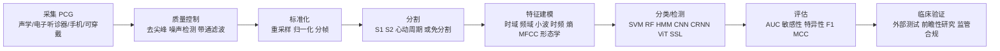

**Executive Summary**

心音诊断（heart sound diagnosis, phonocardiography-assisted diagnosis）正在经历一次从传统听诊走向“数字化采集—信号处理—机器学习/深度学习—临床验证”的方法学重构。公开数据集、电子/数字听诊器、智能手机采集与可穿戴声学传感器的普及，使心音重新成为低成本、可扩展、适合基层与远程医疗的筛查信号；但真正阻碍其临床普及的核心问题，已经从“能否分类”转向“标签是否可靠、数据是否代表真实临床、模型是否跨设备泛化、是否经过前瞻性外部验证与合规审查”。当前证据表明，心音 AI 在杂音检测、某些瓣膜病、儿科病理性杂音分流以及心衰声学生物标志物监测方面已显示价值；但其最佳定位仍是**辅助筛查与转诊分层**，而不是替代超声心动图或独立作出最终诊断。

**摘要**

本文面向具备医学或工程基础的读者，系统综述心音诊断的定义与历史、心音生理病理机制、采集设备与采样参数、噪声与预处理、S1/S2 分割、特征提取、机器学习与深度学习分类、公开数据集与开源生态、临床验证证据，以及性能、局限、伦理与法规问题。总体上，近十年的研究显示：在统一采样、良好去噪、患者级划分、外部验证和以超声或临床结局为金标准的条件下，心音 AI 最有希望落地于基层心脏杂音筛查、儿科先天性心脏病初筛、心衰远程监测和资源受限地区的早期分诊。

## 引言

心音诊断广义上是指通过听诊或数字化心音记录（phonocardiogram, PCG）分析心脏机械活动，以识别正常心音、额外心音、杂音以及与瓣膜病、先天性心脏病、心衰等相关的异常模式。传统听诊已有两百余年历史，而电子听诊器自 20 世纪 70 年代出现后，使录音、回放、放大、滤波、存储与远程共享成为可能；近年的 AI 与移动终端则进一步推动了自动化心音分析复兴。

之所以值得重新审视心音诊断，一是心音本身具有低成本、无创、即时、易部署的优点；二是数字听诊设备与智能手机已经能够稳定采集心音；三是公开数据集和挑战赛显著推动了算法标准化。与此同时，系统综述也一致指出：许多研究虽然报告了较高准确率，但仍存在数据集规模有限、设备与环境异质性大、过拟合、外部验证不足和临床标签不够严谨等问题。

本文的写作目标不是简单罗列模型，而是把**生理—信号—算法—临床—法规**这五条线合并起来，回答一个更实用的问题：**心音 AI 到底在哪些场景真正有价值，距离可信临床部署还差什么。**

## 心音生理学、采集与预处理

正常心音的核心是 S1 和 S2。S1 对应二尖瓣与三尖瓣关闭，发生在收缩期开始；S2 对应主动脉瓣与肺动脉瓣关闭，发生在收缩末/舒张初。S3 和 S4 并非每个人都能听到：年轻人可出现生理性 S3，但在成人尤其高龄患者中，S3/S4 更常被视作心衰、容量负荷增加或心室顺应性下降的声学线索。杂音则本质上来自湍流血流，可按时相分为收缩期、舒张期或连续性杂音。

从生理到病理的映射，决定了算法任务设计。S1/S2 的准确定位支持心动周期划分；周期划分又决定了“收缩期内的杂音”与“舒张期内的杂音”能否被正确解释。对于瓣膜病，时相、频率、强度与传导路径都很关键；对于儿科 CHD，是否存在病理性杂音、在哪个听诊点最明显，常常比单次无定位分类更有临床意义。

采集设备大致可分为四类：传统声学听诊器、电子/数字听诊器、便携/可穿戴设备，以及基于手机麦克风的采集。传统听诊器仍是床旁基础，但无法直接数字化；数字听诊器可以放大、滤波、录音并与软件或云端算法联动；可穿戴设备正在从 MEMS、压电、柔性传感器和低功耗连续监测方向发展；智能手机则证明了“无专用硬件也可完成基础 PCG 采集”的可行性。

在采样参数上，PCG 的信息频谱主要集中在 500 Hz 以下，而有用信息通常在 1 kHz 以下；因此，从信号处理角度看，2–4 kHz 采样率配合合适的模拟/数字抗混叠设计通常已足够。公开数据集中可见到 2 kHz、4 kHz、8 kHz、11.025 kHz、44.1 kHz 乃至 48 kHz 等多种采样率，本质上往往反映的是消费级音频设备与声卡标准，而不是心音本身对超高采样率的需求。

采集噪声是心音算法落地最现实的障碍之一。PhysioNet/CinC 2016 官方页面明确指出，其录音包含说话声、听诊器摩擦/位移、呼吸声和肠鸣音等干扰；儿科场景还经常叠加哭闹、运动伪迹和高心率造成的时相压缩。即便是智能手机采集，在真实用户环境中也存在姿势、胸壁脂肪、年龄、放置点与操作学习曲线等影响因素。

预处理因此几乎是所有系统的“隐形主干”。典型流程包括：带通滤波（常见 20–200 Hz、25–400 Hz 或类似范围）、去尖峰/去基线漂移、归一化、分帧、信号质量评估、必要时的小波去噪或同态包络提取。Potes 等在 2016 挑战冠军方案中将 PCG 重采样到 1000 Hz 并做 25–400 Hz 带通滤波；Li 等在特征工程 + CNN 方法中也将“滤波—正则化—分割”作为分类前置步骤；而智能手机研究则证明，良好的操作指导与简单后处理即可显著提升可解释录音比例。

> 图示占位说明：**图一**可放置“典型 PCG 波形示意图”，标出 S1、收缩期、S2、舒张期，以及收缩期杂音/舒张期杂音的典型位置；若用于博客发布，建议同时展示原始波形、包络与时频图三联图。

## 信号处理、分割与特征建模

S1/S2 识别与心动周期分割是经典 PCG 分析的起点。早期方法通常依赖 Shannon 能量包络、Hilbert 包络、同态包络、小波或经验模态分解，再结合峰值检测、时长先验与规则实现 S1/S2 区分；这类方法可解释性强，但对噪声、心率变化和复杂病理的稳健性有限。

近十年最有代表性的分割里程碑是 Springer 等提出的 logistic regression-HSMM。该方法把 PCG 分成 S1、收缩期、S2、舒张期四状态，使用持续时间依赖的 HSMM 与扩展 Viterbi 解码，并在 112 名患者、超过 1 万秒记录上取得平均 F1 95.63%±0.85%，显著优于其比较基线。这一方法后来几乎成为公开数据集和挑战赛中最常见的“标准分割前端”。

深度学习把分割从“规则与概率图模型”推进到“端到端时序标注”。Renna 等提出 CNN 分割框架；Fernando 等进一步把 BiLSTM 与注意力机制用于心音状态序列建模；与此同时，也出现了“少分割”甚至“免分割”路线，试图避免错误分割在高心率、强噪声和病理杂音场景中的级联传播。Bondareva 等的 segmentation-free 方法就是这一方向的代表，尤其强调用户独立划分下的可迁移性。

特征提取方面，可以按五大类理解。其一是**时域特征**，如周期长度、S1/S2 时长、收缩/舒张比、峰值、偏度、峰度。其二是**频域特征**，如功率谱分布、状态分频带能量。其三是**时频特征**，包括 STFT、Mel 频谱、MFCC、MFSC、连续/离散小波、scalogram、S-transform。其四是**复杂度特征**，如样本熵、排列熵、多尺度熵等。其五是**形态学特征**，如杂音强度包络、波形对称性、音色、Levine 分级相关描述，以及多听诊点之间的时相/幅度关系。Potes 方案中的 124 特征、Li 等的 497 特征、以及许多基于 MFCC 或 log-Mel 的深度模型，都体现了这些设计思想。

在分类与检测层面，现有方法大致分为三条技术路线。第一条是**传统机器学习**：SVM、随机森林、AdaBoost、GMM-HMM、Markov switching 模型等，通常依赖精心设计的时频特征，优点是数据量要求较低、可解释性较强。第二条是**深度学习**：1D-CNN、2D-CNN、CRNN、CNN-BiLSTM、ViT、注意力网络、自监督学习与可学习滤波器组，优点是表征能力强，但对数据划分规范与域泛化尤为敏感。第三条是**混合范式**：先做分割/特征工程，再用深度模型分类，或者由深度模型学习前端滤波器与后端分类器。

评价指标不应只看“准确率”。在心音任务中，类别失衡极常见，且临床更关注漏诊成本，因此常见指标包括敏感性、特异性、AUC、F1、Matthews 相关系数、mAcc，以及 PhysioNet 2022 引入的加权准确率和基于转诊-漏诊成本的 cost score。更关键的是，**必须采用患者级（patient-wise）划分，而非同一患者多个周期或多个听诊点同时出现在训练和测试集中**，否则会严重高估模型性能。PhysioNet 2022 官方页面特别说明其训练/验证/测试采用 patient-wise 分层划分，这一点值得成为后续研究默认标准。

## 公开数据集与开源生态

公开数据集是心音研究的根基，但也是最容易被“平均准确率”掩盖的问题源。当前最常用数据集包括 PASCAL、PhysioNet/CinC 2016、CirCor DigiScope/PhysioNet 2022、EPHNOGRAM、HSCT-11 等。它们在疾病谱、采样率、是否提供 S1/S2 分割、是否有多听诊点、是否有超声心动图或临床结局金标准方面差异巨大，因此**跨论文横向比较必须非常谨慎**。

| 数据集名 | 样本数 | 标注类型 | 采样率 | 可访问性 | 代表性疾病 | 引用 |
|---|---:|---|---:|---|---|---|
| PASCAL Classifying Heart Sounds Challenge | 656 条录音 | 数据集 A：正常/杂音/额外心音/伪迹；数据集 B：正常/杂音/期前收缩；B 含部分人工 S1/S2 标注 | 4000 Hz | 公开下载 | 杂音、额外心音、期前收缩 | [29][30] |
| PhysioNet/CinC Challenge 2016 | 官方训练集 3126 条录音；后续文献常见统一处理版 2435 条 | 正常/异常/不确定；并提供经算法+人工校正的分割注释 | 统一到 2000 Hz | 公开下载 | 瓣膜病、冠心病相关异常等 | [6][7][8] |
| CirCor DigiScope Dataset | 1568 名受试者、5282 条录音；2022 挑战公开训练子集 942 人/3163 条 | 杂音 present/absent/unknown；临床结局 normal/abnormal；多听诊点；杂音时相/形态/音高/分级；S1/S2 分割 | 4000 Hz | 公开下载 | 儿科杂音、先天性/获得性心脏病筛查 | [26][27] |
| EPHNOGRAM | 24 名健康成人、69 条同步 ECG-PCG 记录 | 同步 ECG/PCG、环境噪声辅助通道；适合多模态研究 | 8000 Hz | 公开下载 | 健康/运动应激生理研究，不以疾病分类为主 | [31][32] |
| HSCT-11 | 206 人、412 条录音 | 主要用于生物识别；无系统疾病标签 | 11025 Hz | 公开可得 | 非疾病导向，适合分割/识别方法学验证 | [33] |
| DigiScope 儿科分割数据 | 29 名患儿、29 条录音 | 两位心脏生理学家人工标注 S1/S2 起止 | 4000 Hz | 公开可得 | 儿科心音分割 | [26] |

表一的数据主要综合自官方挑战页、CirCor 原始论文和 PhysioNet 数据页。需要特别说明的是，心音数据集常同时存在“完整数据库”“挑战公开训练子集”“后处理统一版本”三种计数口径；因此，文中若涉及样本数与论文略有差异，优先采用官方发布页或原始数据论文中最可追溯的口径。

**公开数据与代表性开源代码**

- Springer 心音分割 MATLAB 代码：`https://github.com/davidspringer/Springer-Segmentation-Code`
- PhysioNet 2022 官方 Python 示例：`https://github.com/physionetchallenges/python-classifier-2022`
- SpectroHeart（2022 挑战相关深度模型）：`https://github.com/ikwak2/SpectroHeart`
- Listen2YourHeart（自监督心音杂音检测）：`https://github.com/aristotelisballas/listen2yourheart`
- 2022 挑战另一开源实现：`https://github.com/DeepPSP/cinc2022`
- 心音分析综述型资源库：`https://github.com/zhaoren91/awesome-heart-sound-analysis` 

## 临床验证与应用场景

从工程到临床，最重要的问题不是“模型在公开数据上能否达到 95%+”，而是“它在真实医院、真实患者、真实设备与超声金标准面前能否保持性能”。这方面，现有证据最扎实的应用仍集中在心脏杂音/瓣膜病筛查、儿科病理性杂音筛查，以及心衰的声学生物标志物监测。

**表二**列出若干具有代表性的模型和研究，尽量覆盖公开基准、疾病专病、儿科场景与真实临床验证。

| 方法 | 特征/输入 | 数据集 | 性能指标 | 优点 | 局限 | 引用 |
|---|---|---|---|---|---|---|
| Potes 2016：AdaBoost + CNN 集成 | 124 个时频特征 + 四频带心动周期 CNN | PhysioNet/CinC 2016 | 盲测 Sens 0.9424，Spec 0.7781，总分 0.8602 | 挑战冠军；混合特征与深度学习 | 依赖分割；任务仅二分类 | [13] |
| Li 2020：多域手工特征 + 轻量 CNN | 497 个特征，含时域/频域/熵等 | PhysioNet/CinC 2016 | 5 折 CV：Acc 86.8%，Sen 87.0%，Spec 86.6%，MCC 72.1% | 可解释性较强；性能均衡 | 特征工程负担重 | [12] |
| Humayun 2020：可学习滤波器组 CNN | tConv/FIR learnable filterbanks | 多域公开数据 | AUC 91.36%，F1 84.09%，Macc 85.08% | 直接针对跨传感器/域偏移 | 仍以二分类为主 | [14] |
| Bondareva 2021：segmentation-free | 小波去噪 + 降维 + SVM/DNN | PASCAL | Precision：正常 81%，杂音 96%；用户独立设置下 92%/86% | 降低错误分割影响 | 数据集小；报告指标有限 | [15] |
| Zhou 2024：频谱图像编码 + ViT | GAF/MTF 频谱图 + Vision Transformer | 儿科三分类数据集 | AUC：正常 0.92±0.05、无害杂音 0.83±0.04、病理杂音 0.88±0.04 | 任务更贴近儿科真实临床 | 单中心；正常样本部分外源引入 | [43] |
| Liu 2022：RCRnet | 残差卷积递归网络 | 884 条左向右分流 CHD 儿科录音 | Sens 0.932–1.000，Spec 0.944–0.997，Acc 0.940–0.994 | 专病性能高；优于经验听诊 | 疾病范围窄；无法泛化到全部 CHD | [45] |
| Chorba 2021：临床杂音检测算法 | 商业数字听诊平台 + 深度神经网络 | 373 例临床研究 | 杂音检测 Sens 76.3%，Spec 91.4%；去除 I/VI 级软杂音后 Sens 90.0%；AS Sens 97.5%，MR Sens 64.0% | 真实医院数据；与专家比较 | 商业平台；并非所有瓣膜病都高敏感 | [40] |
| Roquemen-Echeverri 2025：商用 AI 外部验证 | Eko 平台 PCG + ECHO 金标准 | 1029 人、4081 条 PCG | 总体 VHD 检测 Sens 39.3%，Spec 82.3%；不同瓣膜病敏感性差异大 | 真实外部验证，非常有价值 | 揭示商品化模型泛化不足 | [42] |

表二有一个重要启示：**算法性能必须放在任务定义和验证场景中解释**。公开挑战上的高分，常代表“在特定数据分布下的筛查能力”；而临床外部验证往往更残酷，尤其当金标准从“人工听诊标签”升级为“超声心动图证实的病变”时，敏感性通常明显下降。

> 图示占位说明：**图二**可放置“主要算法性能对比图”，建议按统一任务重绘为分组柱状图或 forest plot；由于不同研究的任务定义、标签体系和测试集并不一致，不建议直接把跨数据集准确率画在同一轴上而不作说明。

在心脏杂音与瓣膜病场景，Chorba 等基于商业数字听诊平台的研究显示，自动杂音检测总体敏感性 76.3%、特异性 91.4%；若排除最轻度的 I/VI 级杂音，敏感性可升至 90.0%。他们进一步报告，对中-重度及以上主动脉瓣狭窄的识别敏感性可达 97.5%，但对中-重度二尖瓣反流的敏感性仅 64.0%，提示不同病种的可检测性差异很大。更重要的是，2025 年外部验证研究在 1029 人、4081 条真实临床 PCG 上发现，商用平台对 VHD 的总体敏感性只有 39.3%，虽然特异性为 82.3%，但并不足以覆盖所有瓣膜病作为通用筛查工具。与此同时，系统综述也表明，单纯人工心脏听诊对瓣膜病的敏感性与特异性范围很宽，受经验影响极大，这正是 AI 可能最先补位的环节。

在儿科与先天性心脏病场景，AI 的价值更接近“减少不必要转诊并尽早识别病理性杂音”。Papunen 等以前瞻性儿科队列显示，在“确有可闻杂音”的儿童中，算法区分病理与无害杂音的敏感性为 83%，特异性为 97%；但研究同时强调，没有产生杂音的心脏缺陷本方法无法发现。Liu 等针对左向右分流 CHD 的 RCRnet 报告了 0.932–1.000 的敏感性范围和 0.944–0.997 的特异性范围，且优于经验听诊。Zhou 等则把儿科任务进一步细化为“正常—无害杂音—病理杂音”三分类，这比传统二分类更贴近真实门诊决策逻辑。

在心衰场景，心音并不一定用于“疾病确诊”，而更适合做**动态监测的声学生物标志物**。系统综述指出，S3 与 electromechanical activation time（EMAT）是报道最频繁、证据较强的心衰心音指标；相关文献显示它们与左室功能、失代偿风险和临床结局有关。另有研究和综述认为，将 S3/EMAT 与 BNP/NT-proBNP、ECG 或远程症状监测结合，可能比单独听诊更有实际价值。

总体来看，当前最具现实性的应用场景有三类：门诊/基层的病理性杂音转诊筛查，儿科病理性杂音和部分 CHD 的初筛，以及心衰患者的远程随访。真正替代超声、给出具体瓣膜定量严重程度或覆盖“无杂音病变”的终局诊断，现阶段证据仍不足。

## 性能、局限、伦理法规与未来方向

如果只看公开基准，很多论文都能报出 90% 以上的准确率；但从综述与临床验证看，心音 AI 仍有几类结构性局限。第一，**数据集异质**：采样率、设备、听诊点、年龄结构、噪声背景、标签粒度差异大。第二，**标签噪声**：很多旧数据的“异常”只是录音级粗标签，并不知道具体病种；有些则用听诊意见而不是超声作为金标准。第三，**划分不规范**：如果把同一患者不同周期、不同听诊点甚至增强样本同时放到训练和测试中，会高估性能。第四，**外部验证稀缺**：真实世界研究一做，往往性能显著回落。第五，**任务定义不一致**：有的研究分“正常/异常”，有的分“杂音/无杂音”，有的分“病理/无害/正常”，还有的直接预测临床结局，指标无法简单横比。

伦理与法规层面，心音 AI 基本属于医疗器械软件（SaMD）或嵌入式软件功能的范畴。FDA 将 SaMD 定义为“用于一个或多个医疗目的、且不属于硬件医疗器械组成部分的软件”；围绕 AI 医疗器械，FDA 近年持续发布生命周期管理、PCCP、透明度和 GMLP 相关指导，并维护 AI-enabled medical devices 官方清单。对于心音 AI 这样的辅助诊断工具，这意味着研发者不仅要报告 ROC/AUC，更要说明训练数据治理、适用人群、性能漂移、更新机制、人机协作边界和上市后监测策略。

真实商业产品也提醒我们，不应把“获得监管许可”误读为“可替代医生诊断”。例如 Eko Murmur Analysis Software（EMAS）在 FDA 510(k) 文件中的定位是**为临床医师评估心音提供决策支持**，而不是唯一诊断手段；2025 年新一代 EFAST 批件也明确写到其解释结果“旨在支持而非替代临床判断”。同时，欧洲监管实践也越来越强调 AI Act 与 MDR/IVDR 的并行合规，要求高风险 AI 医疗器械在追溯、数据治理、透明度、人类监督和上市后监测方面形成闭环。

未来研究最值得推进的方向，我认为不是再堆一个网络层，而是做以下五件“临床会真正买账”的事情。其一，**以患者为单位的数据治理和验证**，强制 patient-wise split、外部中心验证、前瞻性注册研究。其二，**以超声/临床结局为标签而不是仅用听诊意见**，尤其是瓣膜病和 CHD。其三，**多模态融合**，把 PCG 与 ECG、人口学信息、症状问卷乃至可穿戴运动/呼吸信号结合；EPHNOGRAM 与带同步 ECG 的数字听诊器都为此提供了方向。其四，**更强的鲁棒性与低资源落地**，包括跨设备域适配、噪声建模、自监督学习和手机端/边缘端部署。其五，**可解释性与人机协同**，例如从“此录音异常”升级到“异常出现在收缩期、最可能位于肺动脉/二尖区、对某些病种敏感但不覆盖无杂音病变”的结构化输出。

**开放问题**

当前仍未解决的问题包括：如何建立大规模、跨年龄、跨设备、跨国家、以超声和长期结局为锚点的标准化 PCG 队列；如何让模型在“低质量录音”和“低频率少听诊点场景”中仍保持可靠；如何规范报告标签来源、听诊点策略、分割依赖程度与数据泄漏防控；以及如何把 AI 输出嵌入基层转诊流程，而不是仅停留在论文 benchmark。

**结论**

心音诊断并不是过时技术的“AI 翻新”，而是一个典型的临床信号学再发现过程。它最强的价值不在于替代超声，而在于以极低门槛把“有无异常、是否需要进一步检查”前移到基层、家庭和资源受限环境。过去十年，公开数据集、分割算法、特征工程与深度学习模型已经证明 PCG 可以被系统、稳定地分析；未来十年，决定其临床命运的将是数据标准、外部验证、合规与工作流程整合，而不是单一模型的 SOTA 分数。

## 参考文献

1. Azmeen A, Mauer HP, Krishna Kumar R, et al. *Heart sounds: Past, present, and future from a technological and clinical perspective – a systematic review*. 2023. URL: `https://pubmed.ncbi.nlm.nih.gov/37139865/`
2. Clifford GD, Liu C, Moody B, et al. Recent advances in heart sound analysis. *Physiol Meas*. 2017;38(8):E10-E25. doi: 10.1088/1361-6579/aa7ec8
3. Dornbush S, Wiener R. Physiology, Heart Sounds. *StatPearls*. 2023. URL: `https://www.ncbi.nlm.nih.gov/books/NBK541010/`
4. Thomas SL, Sharma S. Physiology, Cardiovascular Murmurs. *StatPearls*. 2023. URL: `https://www.ncbi.nlm.nih.gov/books/NBK525958/`
5. Liu C, Springer D, Li Q, et al. An open access database for the evaluation of heart sound algorithms. *Physiol Meas*. 2016;37(12):2181-2213. doi: 10.1088/0967-3334/37/12/2181
6. PhysioNet/Computing in Cardiology Challenge 2016 official dataset page. URL: `https://physionet.org/content/challenge-2016/1.0.0/`
7. Springer DB, Tarassenko L, Clifford GD. Logistic Regression-HSMM-Based Heart Sound Segmentation. *IEEE Trans Biomed Eng*. 2016;63(4):822-832. doi: 10.1109/TBME.2015.2475278
8. Oliveira J, Renna F, Mantadelis T, Coimbra M. Adaptive Sojourn Time HSMM for Heart Sound Segmentation. *IEEE J Biomed Health Inform*. 2019;23(2):642-649. doi: 10.1109/JBHI.2018.2841197
9. Renna F, Oliveira J, Coimbra MT. Deep Convolutional Neural Networks for Heart Sound Segmentation. *IEEE J Biomed Health Inform*. 2019;23(6):2435-2445. doi: 10.1109/JBHI.2019.2894222
10. Fernando T, Ghaemmaghami H, Denman S, et al. Heart Sound Segmentation Using Bidirectional LSTMs With Attention. *IEEE J Biomed Health Inform*. 2020;24(6):1601-1609. doi: 10.1109/JBHI.2019.2949516
11. Messner E, Zöhrer M, Pernkopf F. Heart Sound Segmentation—An Event Detection Approach Using Deep Recurrent Neural Networks. *IEEE Trans Biomed Eng*. 2018;65(9):1964-1974. doi: 10.1109/TBME.2018.2843258
12. Li F, Tang H, Shang S, et al. Classification of Heart Sounds Using Convolutional Neural Network. *Appl Sci*. 2020;10(11):3956. doi: 10.3390/app10113956
13. Potes C, Parvaneh S, Rahman A, Conroy B. Ensemble of Feature-based and Deep Learning-based Classifiers for Detection of Abnormal Heart Sounds. *Comput Cardiol*. 2016. URL: `https://moody-challenge.physionet.org/2016/papers/potes.pdf`
14. Humayun AI, Ghaffarzadegan S, Ansari MI, Feng Z, Hasan T. Towards Domain Invariant Heart Sound Abnormality Detection Using Learnable Filterbanks. *IEEE J Biomed Health Inform*. 2020;24(8):2189-2198. doi: 10.1109/JBHI.2020.2970252
15. Bondareva E, Han J, Bradlow W, Mascolo C. Segmentation-free Heart Pathology Detection Using Deep Learning. *Proc IEEE EMBC*. 2021. doi: 10.1109/EMBC46164.2021.9630203
16. Chen J, Guo Z, Xu X, et al. A Robust Deep Learning Framework Based on Spectrograms for Heart Sound Classification. *IEEE/ACM Trans Comput Biol Bioinform*. 2024;21(4):936-947. doi: 10.1109/TCBB.2023.3247433
17. Shuvo SB, Ali SN, Swapnil SI, Al-Rakhami MS, Gumaei A. CardioXNet: A Novel Lightweight Deep Learning Framework for Cardiovascular Disease Classification Using Heart Sound Recordings. *IEEE Access*. 2021;9:36955-36967. doi: 10.1109/ACCESS.2021.3063129
18. Deng M, Meng T, Cao J, et al. Heart sound classification based on improved MFCC features and convolutional recurrent neural networks. *Neural Netw*. 2020;130:22-32. doi: 10.1016/j.neunet.2020.06.020
19. Maknickas V, Maknickas A. Recognition of normal-abnormal phonocardiographic signals using deep convolutional neural networks and mel-frequency spectral coefficients. *Physiol Meas*. 2017;38(8):1671-1684. doi: 10.1088/1361-6579/aa7841
20. Zhang W, Han J, Deng S. Abnormal heart sound detection using temporal quasi-periodic features and long short-term memory without segmentation. *Biomed Signal Process Control*. 2019;53:101560. doi: 10.1016/j.bspc.2019.101560
21. Xiao B, Xu Y, Bi X, et al. Heart sounds classification using a novel 1-D convolutional neural network with extremely low parameter consumption. *Neurocomputing*. 2020;392:153-159. doi: 10.1016/j.neucom.2018.09.101
22. Chen W, Sun Q, Chen X, et al. Deep learning methods for heart sounds classification: A systematic review. *Entropy*. 2021;23(6):667. doi: 10.3390/e23060667
23. Partovi E, Babic A, Gharehbaghi A. A review on deep learning methods for heart sound signal analysis. *Front Artif Intell*. 2024;7:1434022. doi: 10.3389/frai.2024.1434022
24. Ren Z, Chang Y, Nguyen TT, et al. A Comprehensive Survey on Heart Sound Analysis in the Deep Learning Era. *IEEE Comput Intell Mag*. 2024;19(3):42-57. doi: 10.1109/MCI.2024.3401309
25. Ameen A, Abbas S, Hassan M, et al. Advances in ECG and PCG-based cardiovascular disease classification: a review of deep learning and machine learning methods. *J Big Data*. 2024. doi: 10.1186/s40537-024-01011-7
26. Oliveira JH, Renna F, Nogueira M, et al. The CirCor DigiScope Dataset: From Murmur Detection to Murmur Classification. *IEEE J Biomed Health Inform*. 2022. doi: 10.1109/JBHI.2021.3137048
27. PhysioNet Challenge 2022 official dataset page. URL: `https://physionet.org/content/challenge-2022/1.0.0/`
28. Reyna MA, Elola A, Oliveira JH, et al. Heart murmur detection from phonocardiogram recordings. 2023. URL: `https://pmc.ncbi.nlm.nih.gov/articles/PMC10495026/`
29. PASCAL Classifying Heart Sounds Challenge official page. URL: `https://www.peterjbentley.com/heartchallenge/`
30. Gomes EF, Bentley PJ, Coimbra M, Pereira E, Deng Y. Classifying Heart Sounds: Approaches to the PASCAL Challenge. *HEALTHINF 2013*. doi: 10.5220/0004234403370340
31. EPHNOGRAM dataset official PhysioNet page. URL: `https://physionet.org/content/ephnogram/`
32. Kazemnejad A, Rivet B, Sameni R. An Open-Access Simultaneous Electrocardiogram and Phonocardiogram Database. 2024. URL: `https://pmc.ncbi.nlm.nih.gov/articles/PMC12931432/`
33. Spadaccini A, Beritelli F. Performance evaluation of heart sounds biometric systems on an open dataset. *18th International Conference on Digital Signal Processing*. 2013. URL: `https://www.diit.unict.it/hsct11/index.php?dir=&file=Performance+Evaluation+of+Heart+Sounds+Biometric+Systems+on+an+Open+Dataset.pdf`
34. Seah JJ, Jih XJ, Ching KS, et al. Review on the Advancements of Stethoscope Types in Chest Auscultation. *Cureus*. 2023. URL: `https://pmc.ncbi.nlm.nih.gov/articles/PMC10177339/`
35. Ahmad RS, et al. Advancements in wearable heart sounds devices for the early diagnosis and monitoring of heart disease. *Smart Med*. 2025. doi: 10.1002/smm2.1311
36. Roh KM, et al. Advances in Wearable Stethoscope Technology: Opportunities for the Early Detection and Prevention of Cardiovascular Diseases. *Cureus*. 2024. URL: `https://www.cureus.com/articles/318286-advances-in-wearable-stethoscope-technology-opportunities-for-the-early-detection-and-prevention-of-cardiovascular-diseases.pdf`
37. Luo H, et al. Smartphone as an electronic stethoscope: factors influencing heart sound quality. *Eur Heart J Digit Health*. 2022. URL: `https://academic.oup.com/ehjdh/article/3/3/473/6675713`
38. Li Y, et al. Smartphone for heart sound measurement in hospital. 2025. URL: `https://pmc.ncbi.nlm.nih.gov/articles/PMC12088729/`
39. Palm D, et al. Artificial Neural Network Analysis of Heart Sounds Captured From an Acoustic Stethoscope and Emailed Using iStethoscopePro. *J Med Devices*. 2010;4(2):027531. doi: 10.1115/1.4001715
40. Chorba JS, Shapiro AM, Le L, et al. Deep Learning Algorithm for Automated Cardiac Murmur Detection Via a Digital Stethoscope Platform. *J Am Heart Assoc*. 2021;10:e019905. doi: 10.1161/JAHA.120.019905
41. Prince J, Shalen EF, Jacobs PG, et al. Deep Learning Algorithms to Detect Murmurs Associated With Clinically Significant Valvular Heart Disease. *J Am Heart Assoc*. 2023. URL: `https://pmc.ncbi.nlm.nih.gov/articles/PMC10757522/`
42. Roquemen-Echeverri V, Jacobs PG, Shalen EF, et al. External evaluation of a commercial artificial intelligence-augmented digital auscultation platform in valvular heart disease detection using echocardiography as reference standard. *Int J Cardiol*. 2025;419:132653. doi: 10.1016/j.ijcard.2024.132653
43. Zhou G, Chien C, Chen J, et al. Identifying pediatric heart murmurs and distinguishing innocent from pathologic using deep learning. *Artif Intell Med*. 2024;153:102867. doi: 10.1016/j.artmed.2024.102867
44. Papunen I, Ylänen K, Lundqvist O, et al. Automated analysis of heart sound signals in screening for structural heart disease in children. *Eur J Pediatr*. 2024;183:4951-4958. doi: 10.1007/s00431-024-05773-3
45. Liu J, Wang H, Yang Z, et al. Deep learning-based computer-aided heart sound analysis in children with left-to-right shunt congenital heart disease. *Int J Cardiol*. 2022;348:58-64. doi: 10.1016/j.ijcard.2021.12.012
46. Davidsen AH, Andersen A, et al. Diagnostic accuracy of heart auscultation for detecting valve disease: a systematic review. *BMJ Open*. 2023;13:e068121. doi: 10.1136/bmjopen-2022-068121
47. Butler J, et al. The role of cardiac acoustic biomarkers in monitoring patients with heart failure: a systematic literature review. *ESC Heart Fail*. 2025. doi: 10.1002/ehf2.15075
48. Dao L, et al. A systematic review and meta-analysis comparing the ability of S3 heart sound and LVEF to diagnose heart failure. *Front Cardiovasc Med*. 2022. doi: 10.3389/fcvm.2022.918051
49. Sung SH, et al. Effect of Acoustic Cardiography-guided Management on 1-Year Outcomes in Patients With Acute Heart Failure. *J Card Fail*. 2020. URL: `https://www.sciencedirect.com/science/article/abs/pii/S1071916419301927`
50. Wang S, et al. Acoustic cardiography helps to identify heart failure and its phenotypes. *Int J Cardiol*. 2013;167:681-686. doi: 10.1016/j.ijcard.2012.03.067
51. Yang Y, Guo X, Wang H, Zheng YN. Deep learning-based heart sound analysis for left ventricular diastolic dysfunction diagnosis. *Diagnostics*. 2021;11(12):2349. doi: 10.3390/diagnostics11122349
52. U.S. FDA. Artificial Intelligence-Enabled Medical Devices. URL: `https://www.fda.gov/medical-devices/software-medical-device-samd/artificial-intelligence-enabled-medical-devices`
53. U.S. FDA. Software as a Medical Device. URL: `https://www.fda.gov/medical-devices/digital-health-center-excellence/software-medical-device-samd`
54. U.S. FDA. Artificial Intelligence-Enabled Device Software Functions: Lifecycle Management and Marketing Submission Recommendations. URL: `https://www.fda.gov/medical-devices/software-medical-device-samd/artificial-intelligence-software-medical-device`
55. U.S. FDA. Predetermined Change Control Plan for Artificial Intelligence-Enabled Device Software Functions. URL: `https://www.fda.gov/regulatory-information/search-fda-guidance-documents/marketing-submission-recommendations-predetermined-change-control-plan-artificial-intelligence`
56. U.S. FDA. Transparency for Machine Learning-Enabled Medical Devices: Guiding Principles. URL: `https://www.fda.gov/medical-devices/software-medical-device-samd/transparency-machine-learning-enabled-medical-devices-guiding-principles`
57. U.S. FDA. Good Machine Learning Practice for Medical Device Development: Guiding Principles. URL: `https://www.fda.gov/medical-devices/software-medical-device-samd/good-machine-learning-practice-medical-device-development-guiding-principles`
58. U.S. FDA. K213794 510(k): Eko Murmur Analysis Software (EMAS). URL: `https://www.accessdata.fda.gov/scripts/cdrh/cfdocs/cfpmn/pmn.cfm?ID=K213794`
59. U.S. FDA. K251494 510(k): Eko Foundation Analysis Software with Transformers (EFAST). URL: `https://www.accessdata.fda.gov/cdrh_docs/pdf25/K251494.pdf`
60. European Commission MDCG 2025-6. Interplay between the Medical Devices Regulation and the Artificial Intelligence Act. URL: `https://health.ec.europa.eu/document/download/b78a17d7-e3cd-4943-851d-e02a2f22bbb4_en?filename=mdcg_2025-6_en.pdf`
61. ESC/EACTS. 2025 ESC/EACTS Guidelines for the management of valvular heart disease. URL: `https://www.escardio.org/guidelines/clinical-practice-guidelines/all-esc-practice-guidelines/valvular-heart-disease/`
62. ESC. 2020 ESC Guidelines for the management of Adult Congenital Heart Disease. URL: `https://www.escardio.org/guidelines/clinical-practice-guidelines/all-esc-practice-guidelines/adult-congenital-heart-disease/`
63. PhysioNet Challenges. Python example classifier for the PhysioNet Challenge 2022. URL: `https://github.com/physionetchallenges/python-classifier-2022`
64. Springer D. Springer-Segmentation-Code. URL: `https://github.com/davidspringer/Springer-Segmentation-Code`
65. Ballas A, Papapanagiotou V, Delopoulos A, Diou C. Listen2YourHeart: A Self-Supervised Approach for Detecting Murmur in Heart-Beat Sounds. *arXiv*. 2022. URL: `https://arxiv.org/abs/2208.14845`
66. Kwak I, et al. SpectroHeart: A Deep Neural Network Approach to Heart Murmur Detection Using Spectrogram and Peak Interval Features. URL: `https://github.com/ikwak2/SpectroHeart`
67. DeepPSP. cinc2022: Heart Murmur Detection from Phonocardiogram Recordings. URL: `https://github.com/DeepPSP/cinc2022`
68. Ren Z, et al. awesome-heart-sound-analysis. URL: `https://github.com/zhaoren91/awesome-heart-sound-analysis`
69. Noman FM, Salleh SH, Ting CM, et al. A Markov-switching model approach to heart sound segmentation and classification. *IEEE J Biomed Health Inform*. 2020;24(3):705-716. doi: 10.1109/JBHI.2019.2925036
70. Papadaniil CD, Hadjileontiadis LJ. Efficient heart sound segmentation and extraction using ensemble empirical mode decomposition and kurtosis features. *IEEE J Biomed Health Inform*. 2014;18(4):1138-1152. doi: 10.1109/JBHI.2013.2294399
71. Kui H, Chen J, et al. Heart sound classification based on log Mel-frequency spectral coefficients and hidden Markov model. *Biomed Signal Process Control*. 2021. URL: `https://www.sciencedirect.com/science/article/abs/pii/S1746809421004900`
72. Guven M, et al. Long Short-Term Feature Extraction from Heart Sound Data. *Sensors*. 2023;23(13):5835. doi: 10.3390/s23135835
73. Moukadem A, Dieterlen A, Brandt C, et al. A robust heart sounds segmentation module based on S-transform and Shannon energy. *Biomed Signal Process Control*. 2015. URL: `https://pmc.ncbi.nlm.nih.gov/articles/PMC4450340/`
74. Ogawa S, et al. AI diagnosis of heart sounds differentiated with super-normal hearing. *J Cardiol*. 2024. URL: `https://www.journal-of-cardiology.com/article/S0914-5087(23)00229-0/fulltext`
75. Zhou Z, Xie K, et al. Automatic Diagnosis of Left Valvular Heart Disease Based on Artificial Intelligence Stethoscope. *JACC Adv*. 2025;4(11):101993. doi: 10.1016/j.jacadv.2025.101993
76. Abdullah Jabbar A, et al. Congenital Heart Disease Classification Using Phonocardiograms: A Scalable Screening Tool for Diverse Environments. *arXiv*. 2025. URL: `https://arxiv.org/abs/2503.22773`